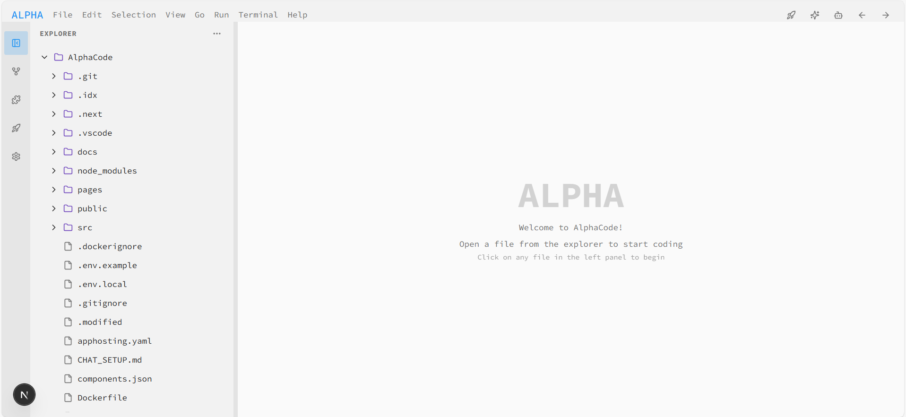
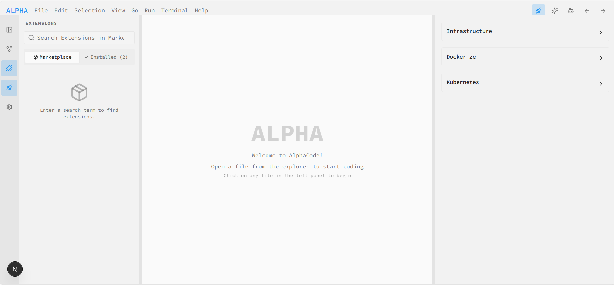
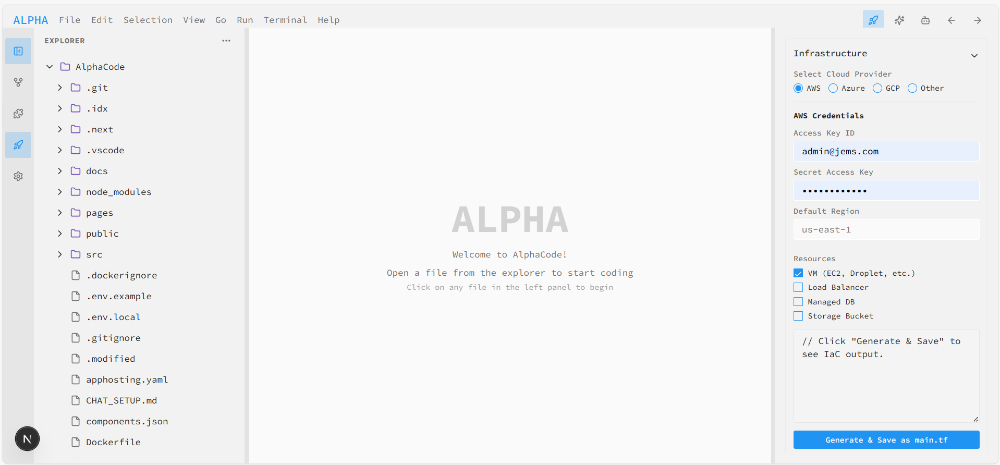
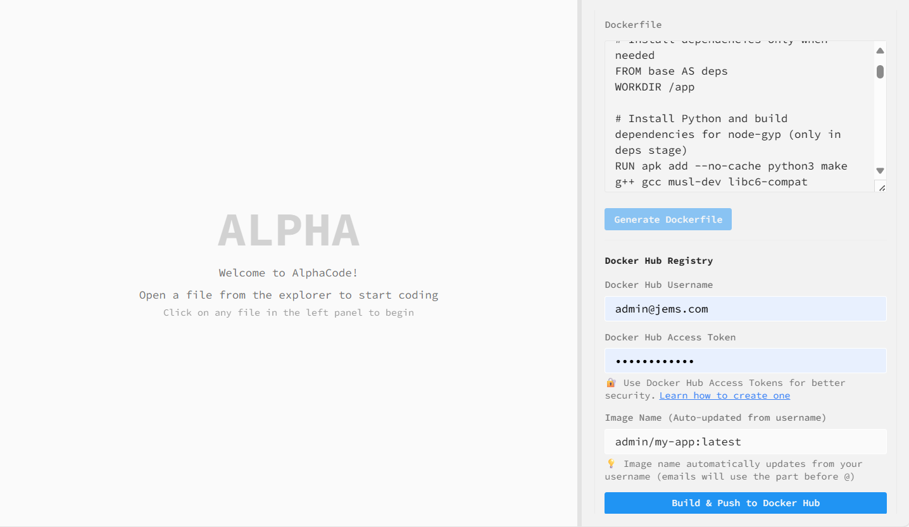
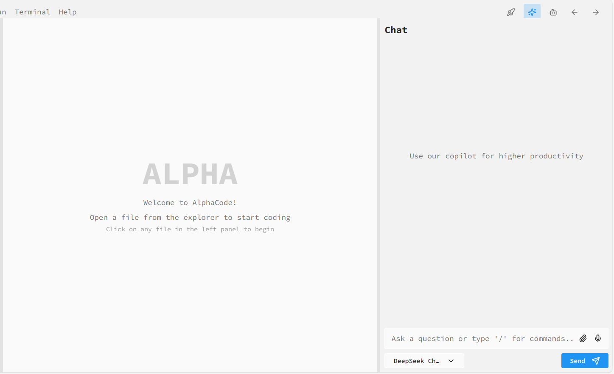
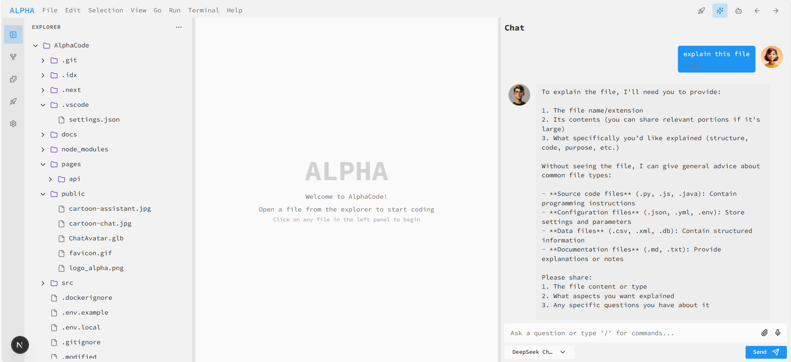

# AlphaCode

AlphaCode is a modern developer interface inspired by Visual Studio Code, built with Next.js, TypeScript, and Tailwind CSS. It provides a beautiful, extensible, and cloud-ready environment for code editing, deployment, and collaboration.

## 🚀 Features

- **VS Code-inspired UI**: Familiar layout with file explorer, tabs, activity bar, and command palette
- **Next.js 15+**: Fast, scalable, and production-ready React framework
- **TypeScript**: Type-safe codebase for reliability and maintainability
- **Tailwind CSS**: Utility-first styling for rapid UI development
- **Docker Integration**: Build, push, and deploy containers directly from the UI
- **Cloud Provider Support**: AWS, Azure, GCP, and more
- **Kubernetes YAML Editor**: Edit and apply deployment/service configs
- **Extensible Components**: Easily add new panels, hooks, and UI elements
- **Hosted Mode**: Push images to Docker Hub when running in cloud/hosted environments

## 📸 Screenshots

Below are some screenshots of AlphaCode in action:

|  |  |  |
|:-------------------------------:|:-----------------------------------:|:-------------------------------:|
| Editor                          | Extensions                          | Panel                        |

|  |  |  |
|:-------------------------------:|:-----------------------------------:|:-------------------------------:|
| Deploy                          | File Explorer                       | Chat                            |
## 🛠️ Getting Started

### Prerequisites

- Node.js 20+ (recommended: Node.js 22)
- npm or yarn
- Docker (for container builds)

### Installation

```bash
# Clone the repository
git clone https://github.com/sirine707/AlphaCode.git
cd AlphaCode

# Install dependencies
npm install
# or
yarn install
```

### Development

```bash
npm run dev
# or
yarn dev
```

Visit [http://localhost:3000](http://localhost:3000) to start using AlphaCode.

## 🐳 Docker Usage

### Build and Run Locally

```bash
# Build the Docker image
docker build -t alphacode:latest .

# Run the container
docker run -p 3000:3000 alphacode:latest
```

### Docker Hub Integration

- In hosted mode, images are automatically pushed to Docker Hub.
- Provide your Docker Hub username and access token in the Deploy panel.

## ☁️ Cloud & Kubernetes

- Provision infrastructure for AWS, Azure, GCP, and more
- Edit and apply Kubernetes deployment/service YAMLs

## 🧩 Project Structure

```
AlphaCode/
├── src/
│   ├── app/
│   ├── components/
│   ├── hooks/
│   ├── lib/
│   └── ...
├── public/
├── pages/
├── Dockerfile
├── next.config.ts
├── tsconfig.json
├── tailwind.config.ts
├── package.json
└── ...
```

## 📝 Contributing

1. Fork the repo and create your branch
2. Make changes and commit
3. Open a pull request

## 📄 License

MIT

## 💬 Support & Feedback

- Issues: [GitHub Issues](https://github.com/sirine707/AlphaCode/issues)
- Discussions: [GitHub Discussions](https://github.com/sirine707/AlphaCode/discussions)

---

AlphaCode © 2025 sirine707
